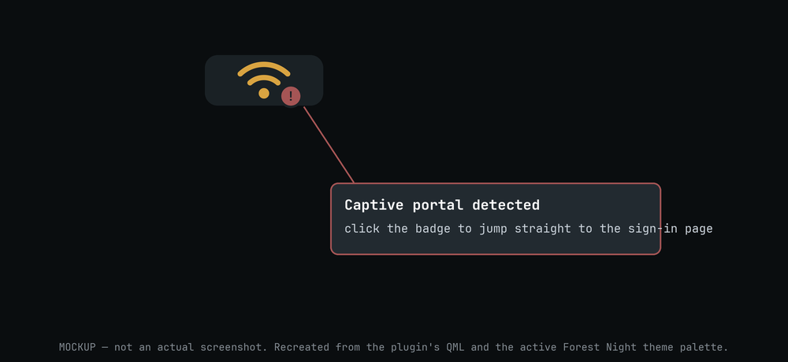

# OmaWifiCaptive

A Wi-Fi bar widget for Omarchy, built on top of the stock network widget,
with two things added:

- **Captive portal detection.** Land on a hotel or airport network that
  needs a login page, and the widget badges the icon and gives you a direct
  click to force the sign-in redirect, instead of you discovering the
  internet is broken five minutes later.
- **An encryption traffic light.** The Wi-Fi icon is colored by how the
  current connection is secured — green for WPA3, amber for WPA2, red for
  anything weaker or open. One glance tells you whether you should think
  twice before doing anything sensitive on it.

Everything else — the network list, signal bars, DNS switching, Wi-Fi band
selection, speed test, QR sharing — behaves the same as Omarchy's built-in
network widget, since that's what this started from.

## Why the captive-portal badge matters


*Mockup — not an actual screenshot. Colors and sizing are taken from the
plugin's own QML and the active theme palette, not invented.*

Hotel, airport, and café Wi-Fi all share the same trick: you join the
network, the icon goes solid, and nothing still works. That's not your
connection being broken — it's a captive portal silently intercepting every
request until you log in through its page, and most browsers and apps give
you zero indication that's what's happening. You just see "connected" and
have no idea why nothing loads.

OmaWifiCaptive catches this the moment NetworkManager reports it — a small
red badge lands on the Wi-Fi icon in your bar as soon as you're behind a
portal, not after you've already tried and failed to load three pages.
Click it and you're dropped straight onto `neverssl.com`, the fastest
reliable way to trigger the portal's real login screen (it's plain HTTP on
purpose, so the portal can actually intercept and redirect it — most real
sites are HTTPS now, which portals can't safely hijack, so they just hang
instead of redirecting you).

No opening a browser, no typing a random URL and waiting to see if it's
your Wi-Fi or the site that's broken. You see the badge, you click it,
you're on the login page.

## Install

Review the repository, then add the plugin:

```bash
omarchy plugin add https://github.com/martinselinga/omawificaptive.git
```

Accept the prompt to enable the plugin during installation. Enabling it adds
it to the bar as a `bar-widget`; it does not replace Omarchy's built-in
network widget automatically, so disable or remove that one if you don't
want both.

For an unattended install from a repository you already trust:

```bash
omarchy plugin add https://github.com/martinselinga/omawificaptive.git --enable --yes
```

## Update

```bash
omarchy plugin update martinsel.omawificaptive
```

Or update all Git-managed plugins:

```bash
omarchy plugin update --all
```

## Validate from source

```bash
omarchy plugin validate .
```

## Security

This plugin runs unsandboxed inside `omarchy-shell` when enabled. It shells
out to:

- `omarchy-network-status --verbose`, `omarchy-network-band`, `omarchy-dns`
  — the same status/configuration commands the stock network widget uses.
- NetworkManager directly through Quickshell's `Networking` backend for
  connecting, disconnecting, forgetting networks, and toggling Wi-Fi.
- `nmcli` (via a bundled connect script) when setting up an 802.1X
  enterprise connection; the password is piped over stdin, never passed as
  an argument. The profile validates the RADIUS/auth server's certificate
  against the system trust store (`802-1x.system-ca-certs yes`), so a
  self-signed cert (the "accept anything" case) is rejected — but CA
  validation alone still accepts a certificate from *any* publicly trusted
  CA, which would let a rogue AP present a cheap cert for a domain the
  attacker owns and still pass. To close that, the enterprise connect prompt
  **requires** a "Server domain" (e.g. `radius.company.com`) before the
  Connect button enables; it's passed as `802-1x.domain-suffix-match`, so
  NetworkManager also checks that the presented cert actually matches your
  organization's domain. There's no way to connect to an enterprise network
  through this panel without it. A private or self-signed internal CA still
  isn't handled — the panel doesn't collect a custom `ca-cert` path today, so
  that case needs manual `nmcli` setup.
- `wl-copy`, to copy the IP address or gateway to your clipboard when you
  click those fields.
- Your configured browser, to open `http://neverssl.com` when you click the
  portal badge or the "sign in" button — this is the only outbound network
  request the widget itself initiates beyond normal network status
  polling.

No background services beyond the normal polling the bar widget does while
open.

## License

MIT — see [LICENSE](LICENSE).
